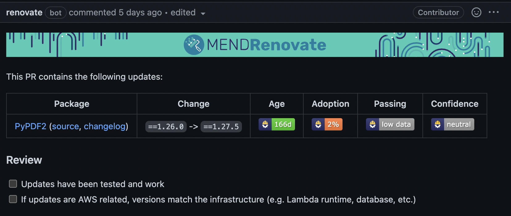
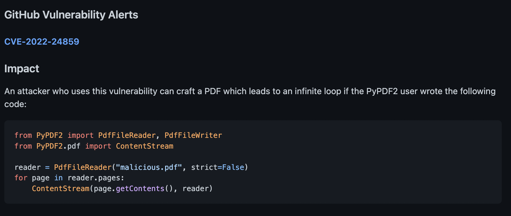
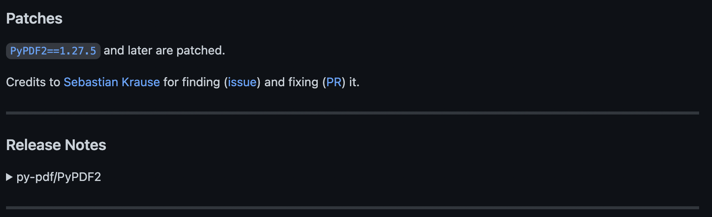
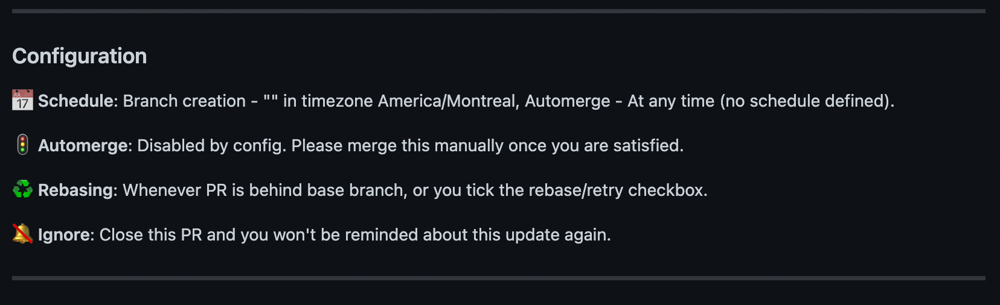
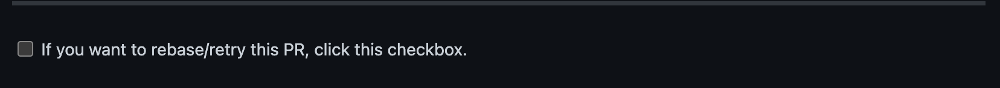

# Renovate Configuration

#### While we already include a broad base configuration by default you can also add to, and extend your own repo's configuration to meet your project's needs. 

<br>

#### By default the base configuration covers most of the common package dependency standards found in popular languages. However if you are interested in customizing further for your language of choice please consult the [Renovate Docs](https://docs.renovatebot.com/). 

<br>

<h2 align="center">
*** NOTE *** 
<br>
***** DO NOT OVERRIDE BASE CONFIGURATIONS LOCALLY *****
</h2>

  If your team feels the base configuration does not meet your needs please come and contact us in Slack in `#platform-core-services`! We are a lovely bunch and are more than happy to help fix your pain points! We can also explain the reasoning behind the settings chosen and help you find a compromise without sacrificing security. We also welcome PRs against the `cds-snc/renovate-config` repo if you find a bug or have a suggestion for a good base setting other teams might benefit from!

# 

## Table of Contents:
1. [Base Configuration](#base-configuration)
2. [Anatomy of a PR](#anatomy-of-a-pr)
3. [Language specific tips and tricks](#language-specific-tips-and-tricks)
   1. [Python](#python)
   2. [Javascript](#javascript-and-nodejs)
4. [Gotchas](#common-gotchas)

#

<h2 align="center">
Base Configuration
</h2>

<br>

### What's included?
The base configuration covers most popular languages (Python, JS/Node.js, Ruby, Go are all included), sorry Max - no Rust yet! But each configuration setup included looks for best practise dependency tracking files in each project (`package.json` for Node.js, `requirements.txt` for Python projects). This can also be customized locally if your team is using nonconventional names for your tracking files.

<br>

Each repo will also have their own Dependency Dashboard gently lurking in their Issues board on Github. This dashboard shows which updates are waiting to be addressed by developers in the workflow agreed upon by each team (Scrum, Kanban, Sprint etc). When develpers create branches and PRs from the Dependency Dashboard they can then see the most up to date information available to help them integrate the updates. 

<br>

This Dashboard is updated on a weekly basis so that teams don't feel overwhelmed by a constant and neverending list of dependency PRs!

<br>

We only allow a maximum of 10 PRs to be open on the repo at any one time. This minimizes the feeling of work never quite completing since open PRs that can't be addressed in a timely manner end up feeling like meaningless work

<br>

Groups some like dependencies together, such as linters. You can also customize other groupings that make sense for you and your team. This also minimizes context switching.

<br>

Automatically rebases stale PRs, which are defined as those lasting longer than 21 days. This should be enough time to address major or critical updates. If an update is deemed infeasable for the time being you can move it into a temporary `ignore` state. However we don't recommend this. This option should be for patches that can't be fixed until the upstream maintainers fix a critical bug or issue.

<br>

Uses semantic PR prefixes (for example `fix-`, `bug-`, or `chore-`)

<br>

Updates Docker images on major updates only as well as pins image digests instead of tags. Tags are just pointers that can be maliciously updated to point to bad images, whereas digest SHA IDs ensure you're consistenly pulling down secure and reliable images.

<br>

Automatically pins the Renovate Github Action to it's respective digest as well, ensuring we're always using the offical Renovate Bot action!

<br>

PR creation is set to immediate meaning as soon as a branch with the updated dependencie is created so is the PR. It is recommended you do not override this value. You can set this to either create a PR upon successful repo status checks or passiing tests but this can be brittle and undermine the point of automatic dependency management. There is also a manual setting to require human approval, but this will create a bottleneck in your PR process. Note this means approval to create a PR, not like a code approval to merge an already existing one! Adding an additional step that may not be useful.

<br>

Automatically filters for our preset of 7 days for Stability Days. This is the number of days since the patch/update was released. This isn't an immediate green light that the patch will work for you though! You still have to look into the changes, test your code, cover all aspects of due diligence, as well as weigh the success of a patch/update by how many people have already merged it with no issue.

[Back to top](#renovate-configuration)
#
<h2 align="center">
Anatomy of a PR   
</h2>
   
- ### Header will include stats on Stability Days or the number of days a release has been available as well as the percentage of other projects using that package that have successfully onboarded that release.
    

- ### Relevant CVE information to determine how critical a patch/update will be to your project.
    

- ### Links to release notes regarding the update. This allows you to read about possible breaking changes, and understand what was fixed. If you have to update your code to accomodate your code this is invaluable information to have.   
    

- ### Current configuration settings that apply to this PR
    

- ### And a handy automatic rebase option if you need it if time passes while you're researching your update. This way you can keep your PR nice and fresh while you're preparing any code changes on the branch to accomodate the upgrade. Keep in mind this rebase will also happen as soon as a PR hits the stale date of 21 days! So rebase as often as you can if an update is requireing a little more rework than planned!
    

[Back to top](#renovate-configuration)
#

<h2 align="center">
Language specific tips and tricks   
</h2>

### Python:
- Renovate supports `pip`, `pipenv`, `setup.py`, and `setup.cfg` by default. You don't have to change anything if you are using any of thesze.
- Renovate will then look up dependencies on `PyPi` and determine if upgrade are available
- The default file Renovate looks for is `requirements.txt` if you're using different nameing conventions you can add this to your local config. You can add file names or use regex to filter:

```json
{
    "pip_requirements": {
        "filematch": ["my-list-of/specifically-named.files"]
    }
}
```
<br>

## Javascript and Node.js
- Renovate looks for `package.json` and supports `npm`, `yarn`, and `pnpm`
- Renovate can also manage your `Node.js` versioning
  - For this reason it's probably best to pin your version of `Node.js` in the `engines` field in your `package.json` file.
  - In the following example, this will pin your version to any and all updates included in the 16 release and PRs will be created accordingly. 
```json
    "engines":
    {
        "node": "^16.0.0"
    }
```
  
- To further customize your Renovate bot for `Node.js` projects see the [Renovate Docs for Node here.](https://docs.renovatebot.com/configuration-options/#node)

[Back to top](#renovate-configuration)
#

## Gotchas
- You cannot have different sets of configuration settings across different branches! Your settings will always be taken from the branch that is set as your default branch. You can apply Renovate to scan as many branches as you'd like, just keep in mind you can't have custom settings _per_ branch.
- Any dependency rollbacks that are applied to your code will automatically have any open PRs on that dependency closed. *WE MAY HAVE AN AUTOMATED SETTING TO OPEN PROPOSED DOWNGRADES BUT FOR NOW WE DON'T - STAY TUNED*

[Back to top](#renovate-configuration)

#

